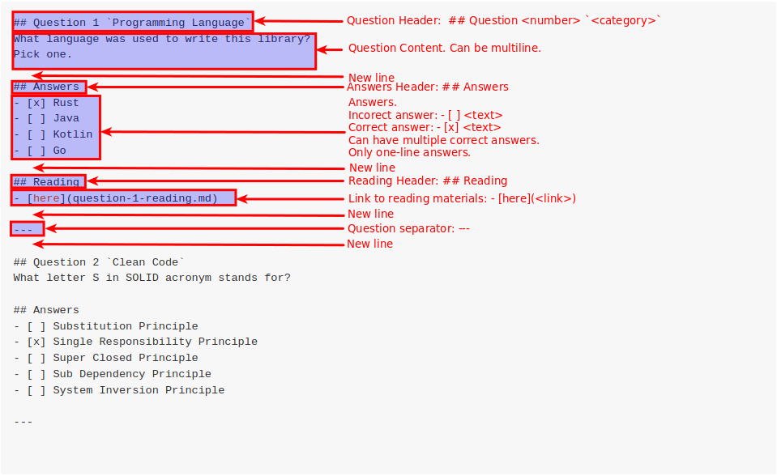

<div align="center">

  <h1><code>md-questions</code></h1>

  <p>
    <strong>Parses markdown to get questions based on a convention</strong>
  </p>

  <p>
    
    <a href="https://codecov.io/gh/devzbysiu/md-questions">
      
    </a>
    <a href="https://crates.io/crates/md-questions">
      
    </a>
    <a href="https://docs.rs/md-questions">
      
    </a>
  </p>

  <h4>
    <a href="#about">About</a>
    <span> | </span>
    <a href="#installation">Installation</a>
    <span> | </span>
    <a href="#license">License</a>
    <span> | </span>
    <a href="#contribution">Contribution</a>
  </h3>

  <sub>Built with 🦀</sub>
</div>

# <p id="about">About</p>

The idea is simple: you write questions in markdown file using some convention, then you can use this library to
parse this markdown. Example markdown questions:



Reading section is optional. All the rest is required to correctly parse the markdown.

Then you can read the questions as following:
```rust
let content = read_to_string("./QUESTIONS.md")?;
let questions = Questions::from(content.as_str());

println!("First question: {}", &questions[0].text());
```

# <p id="installation">Installation</p>

Add
```toml
md_questions = "0.1.0"
```
to your `Cargo.toml`

# <p id="license">License</p>

This project is licensed under either of

- Apache License, Version 2.0, (LICENSE-APACHE or http://www.apache.org/licenses/LICENSE-2.0)
- MIT license (LICENSE-MIT or http://opensource.org/licenses/MIT)

at your option.

# <p id="contribution">Contribution</p>


Unless you explicitly state otherwise, any contribution intentionally submitted for inclusion in the work by you, as defined in the Apache-2.0 license, shall be dual licensed as above, without any additional terms or conditions.
