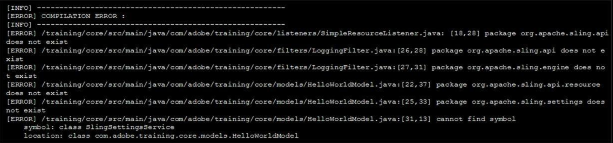

## Question 1
A developer needs to create a banner component. This component shows an image across the full width of the page. A title is shown on top of the image. This text can be aligned to the left, middle, or right. The core components feature a teaser component which matches almost all requirements, but not all. What is the most maintainable way for the developer to implement these requirements?

## Answers
- [ ] Use and configure the teaser core component.
- [ ] Create a new custom component from scratch.
- [ ] Overlay the teaser core component.
- [x] Inherit from the teaser core component.

> Templates and Components

---

## Question 2
The dependency of an AEM project fails when a developer configures using Apache Maven. Refer to the error information below: . What should a developer add to the pom.xml to fix the Maven build?

## Answers
- [x] this :
  ```xml
    <dependency>
      <groupId>com.adobe.aem</groupId>
      <artifactId>uber-jar</artifactId>
      <version>6.4.0</version>
      <classifier>apis</classifier>
      <scope>provided</scope>
    </dependency>
  ```
- [ ] this:
  ```xml
    <repositories>
      <repository>
        <id>com.adobe.aem</id>
        <name>Adobe Public Repository</name>
        <url>...</url>
        <layout>default</layout>
      </repository>
    </repositories>
  ```
- [ ] this:
  ```xml
    <dependency>
      <groupId>com.adobe.aem</groupId>
      <artifactId>aem-api</artifactId>
      <version>6.4.0</version>
      <classifier>apis</classifier>
      <scope>provided</scope>
    </dependency>
  ```
- [ ] this:
  ```xml
    <resources>
      <resource>
        <directory>src/mail/content/jcr_root</directory>
        <filtering>false</filtering>
        <excludes>
          <exclude>**/.vlt</exclude>
          <exclude>**/.vltignore</exclude>
          <exclude>libs/</exclude>
        </excludes>
      </resource>
    </resources>
  ```

<h2>Reading</h2>

> Packaging and Deploying AEM projects

---

